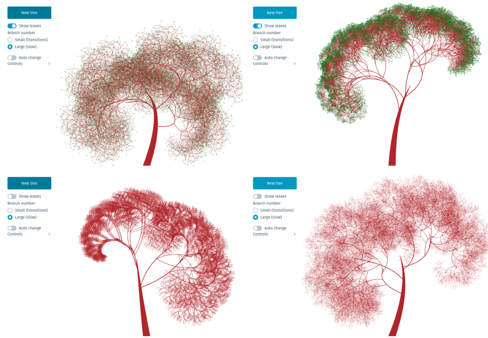

# Svelte Fractal Trees

I wanted to try Svelte's self-calling components and building some fractal trees recursively seemed a good way to do that and end up with something pretty for an xmas project.



The trees are made by generating a few random variables specifying branch orientation relative to the parent branch (or trunk), branch scale and the branch curve, made using SVG bezier curves. Another key variable is the number of times the tree branches - too large and the SVG will get sluggish.

If the tree is small enough (around three branches with five branching steps) it can support Svelte transitions, moving smoothly from one tree to another in a rather cool way. You can also turn the leaves on or off - by default these are added to the end of the last branches.

The key recursive element is the use of Svelte's `svelte:self` tag, allowing a self-calling component:

```html
<g>
  <!-- Draw branches and leaves -->
  <path
    bind:this="{el}"
    {d}
    stroke="brown"
    fill="transparent"
    stroke-width="{6}"
  />
  <!-- ... -->
  {#if branchNum > 0}
    {#each branches as b}
  <!-- Use svelte:self to add branches to this branch -->
  <g class="branch" transform={branchTransform(b)}>
    <svelte:self
      {...b}
      {branches}
      {markers}
      {markerSize}
      {markerY}
      branchNum={branchNum-1}
    />
  </g>
    {/each}
  {/if}
</g>
```

## Get started

Install the dependencies...

```bash
npm install
npm run build && npm run preview
```

Your app will be running at [localhost:4173](http://localhost:4173).

## Developing

```sh
# if you didn't already install, run the install command
npm install
npm run dev
```

Your app will be running at [localhost:5173](http://localhost:5173).
